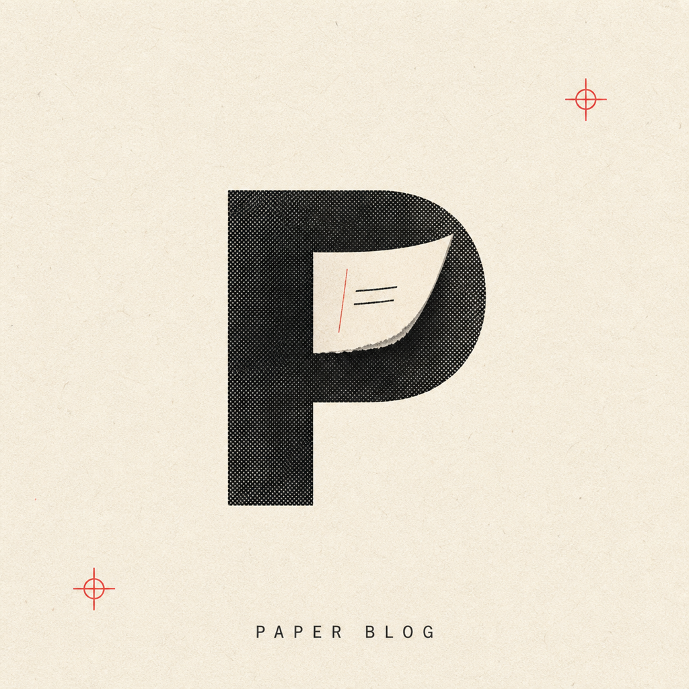

<div align="center">
  

  <h1>Paper</h1>

  <p><strong>写简单的文字，做干净的博客。</strong></p>
  <p>从 Markdown 写作到 GitHub Pages 上线，一条 macOS 优先的极简路径。</p>

  <p>
    <a href="https://ohmyangboy.github.io/paper-blog/">官方网站</a> ·
    <a href="#安装">安装</a> ·
    <a href="#快速开始">快速开始</a> ·
    <a href="https://github.com/ohmyangboy/paper-blog/issues">问题反馈</a>
  </p>

  <p>
    
    
    
    
  </p>
</div>

---

## 软件简介

Paper 是一个 macOS 优先的 Markdown 静态站点生成器与写作 CLI。它把新建草稿、本地预览、文章发布和 GitHub Pages 部署收进同一个终端工作流，让个人博客把注意力留给文字，而不是构建工具。

正式运行时只有 Python。普通用户通过 Homebrew 一次安装，不需要 Node、npm，也不需要手动修复 pip 依赖。

## 核心亮点

- **写作到上线**：`paper new`、`paper serve`、`paper publish` 串起完整写作流程。
- **方向键控制台**：直接运行 `paper` 即可管理首页、草稿与已发布文章；首页固定在第一项，文章按修改时间排序，并用 🟢 / ⚪ 标明状态。
- **本地热更新预览**：自动打开浏览器，监听 Markdown 与资源变更；草稿不会进入生产构建。
- **GitHub Pages 发布**：配置一次仓库后构建并推送 `gh-pages`，保留失败后的重试与状态检查。
- **Obsidian 友好**：支持常用图片嵌入语法，并可把 vault 内文章交给 Obsidian 打开。
- **完整订阅输出**：生成 RSS 2.0 与 sitemap；RSS 含完整正文、绝对链接、作者与站点图标。
- **原稿安全边界**：Paper 管理配置和静态输出，不会在卸载时删除关联的 Markdown 原稿。
- **启动更新提醒**：进入 Paper 控制台前会轻量检查 Release；发现新版本时提示运行 `paper update`，检查失败不会阻塞写作。

## 安装

要求：macOS、Homebrew。

```sh
brew install ohmyangboy/tap/paper
```

安装完成后检查环境：

```sh
paper --version
paper doctor
```

Homebrew 安装的版本可直接自更新：

```sh
paper update
```

## 快速开始

关联已有 Markdown 目录：

```sh
paper link ~/Documents/Notes
```

或者创建标准文章目录：

```sh
paper init
```

然后开始写作：

```sh
paper new "Hello Paper"
paper serve
paper publish
```

直接运行 `paper` 会进入方向键控制台；支持 `↑/↓`、`j/k`、数字键和 Enter。首页按一次 Esc/Q 会显示退出确认，再按一次才退出；Ctrl+C 会安静退出并恢复终端屏幕。

## 常用命令

| 命令 | 作用 |
| --- | --- |
| `paper` | 打开交互式文章控制台 |
| `paper new "标题"` | 新建草稿并交给默认编辑器打开 |
| `paper list` | 查看首页、草稿与已发布文章 |
| `paper serve` | 启动仅绑定 `127.0.0.1` 的热更新预览 |
| `paper build` | 生成生产静态站点 |
| `paper publish` | 勾选草稿、发布并同步 GitHub Pages |
| `paper deploy` | 重试上一次 GitHub Pages 部署 |
| `paper status` | 查看站点与发布状态 |
| `paper config` | 设置目录、编辑器、仓库、颜色与 favicon |
| `paper update` | 通过 Homebrew 升级 Paper |

## 写作格式

Paper 只扫描关联目录顶层的 Markdown 文件。没有 `published: true` 的文章默认为草稿；展示标题默认取文件名，只有显式写入 `title` 才会覆盖。

```md
---
title: Hello Paper
date: 2026-08-13
published: true
description: 第一篇 Paper 文章
---

# Hello Paper

从这里开始写。
```

Paper 以 `markdown-it-py` 的 CommonMark 为基线，并支持表格、删除线、任务列表、代码高亮和单回车换行。原始 HTML 默认转义，不支持 MDX。

### 图片与 Obsidian

推荐把本地图片放在文章目录的 `assets/` 中：

```md

```

也可以引用其他相对路径或绝对路径；构建时 Paper 会把实际用到的本地图片复制进发布资源，不修改原图，也不会保留已经从正文移除的旧发布副本。

兼容的 Obsidian 图片语法包括：

```md
![[image.png]]
![[image.png|说明]]
![[image.png|300]]
![[image.png|300x200]]
```

只有文件名时会递归查找关联的文章目录，并要求文件名唯一。Paper 不展开 `![[笔记]]`，也不搜索关联目录之外的附件。

图片压缩默认开启，只处理构建/预览输出副本。可通过 `paper config compress on|off` 切换。

## 品牌与站点配置

`paper config` 可设置：

- GitHub remote 与 Pages 地址
- 文章目录与默认编辑器
- 主题高亮颜色
- favicon：默认使用 Paper zine 官方图标，也支持本地图片、SVG、Data URI 或图片 URL
- 图片压缩

RSS 2.0 同时提供标准 `description` 与 `content:encoded` 完整正文。站内链接和图片会转换为绝对 URL；频道与文章作者默认从 GitHub remote 推断，并写入 `dc:creator`。订阅源标题显示为 `Paper Blog @用户名`，配置了公开 favicon 时也会输出频道图片。

## 数据边界

- 用户原稿：由 `paper link` 关联，卸载 Paper 时不会删除。
- 配置：`~/.paper/config.json`。
- 更新检查缓存：`~/.paper/update-check.json`，仅保存检查时间与公开 Release 版本号。
- 静态托管目录：`~/.paper/site`。
- Homebrew 安装包：由 Homebrew 私有 Python 环境管理。

## 从源码开发

要求：Python 3.11+。

```sh
git clone https://github.com/ohmyangboy/paper-blog.git
cd paper-blog
python3 -m pip install -e .
python3 paper.py --version
python3 -m unittest discover -s tests -v
```

Python CLI 与静态构建链是唯一正式运行时；发布版不依赖历史 Next.js 原型。

## 官方图标

Paper Blog 官方图标采用暖白纸张、黑色网点印刷、从大 P 内窗翻出的纸页与红色套准标记，视觉语言参考了 [GC Minimal Zine Poster](https://github.com/LiamGvchi/gc-minimal-zine-poster) 的诗性纸感留白体系，并为 Paper 的“写作 → 发布”关系重新设计；它不沿用 Paper RSS 的撕裂字母图形。

## 开源协议

Paper 基于 [GNU General Public License v3.0](LICENSE) 开源。
