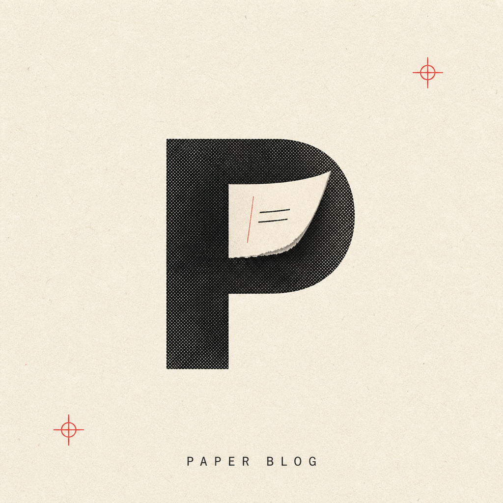

<div align="center">
  

  <h1>Paper</h1>

  <p><strong>写简单的文字，做干净的博客。</strong></p>
  <p>从 Markdown 写作到 GitHub Pages 上线，一条专为创作者设计的极简路径。</p>

  <p>
    <a href="https://ohmyangboy.github.io/paper-blog/">官方网站</a> ·
    <a href="#-安装">安装指南</a> ·
    <a href="#-快速开始">快速开始</a> ·
    <a href="#-全局模式与局部项目模式">运行模式</a> ·
    <a href="https://github.com/ohmyangboy/paper-blog/issues">问题反馈</a>
  </p>

  <p>
    
    
    
    
  </p>
</div>

---

## 软件简介

Paper 是一个 macOS 优先的 Markdown 静态站点生成器与写作 CLI。它把新建草稿、本地预览、文章发布和 GitHub Pages 部署收进同一个终端工作流，让个人博客把注意力留给文字，而不是复杂的构建配置。

正式运行时基于 Python。普通用户通过 Homebrew 一次安装，不需要 Node、npm，也不需要手动配置 pip 依赖。

---

## 核心亮点

- **全流程打通**：`paper new` $\rightarrow$ `paper serve` $\rightarrow$ `paper publish` 一气呵成。
- **方向键控制台**：直接输入 `paper` 唤出 TUI 控制台，首页置顶，草稿与已发布用 🟢 / ⚪ 清晰区分。
- **双运行模式**：支持随时随地写作的**全局模式**，也支持独立仓库管理的**项目目录模式（`-l`）**。
- **全局项目库**：`paper all` 一览所有已登记的本地博客项目（软链接登记，项目删除后自动失效），选中即可进入对应仓库的文章 / 设置 / 发布控制台。
- **双语国际化支持**：CLI 控制台与向导原生支持中文与英文，提供 `--lang [zh_CN|en_US|auto]` 与交互式语言切换。
- **LaTeX 数学公式**：内置极简数学公式渲染引擎，原生支持行内 `$E=mc^2$` 与独立块级公式 `$$\dots$$`。
- **本地热更新预览**：进入控制台即按项目文件夹在后台自动启动轻量 HTTP 服务，顶部标题下显示 `🌐预览` 地址并监听变更自动刷新；同一文件夹多次打开共用一个实例（引用计数），最后一个控制台退出时自动关闭；草稿不会意外流出到生产构建。
- **GitHub Pages 自动化**：配置一次仓库即可全自动构建并推送 `gh-pages` 分支。
- **Obsidian 深度兼容**：支持 `![[image.png|300|center]]` 等图片尺寸与居中对齐排版语法，可一键唤醒 Obsidian 原生应用编辑。
- **图片尺寸与圆角**：标准 Markdown 也能用 `?w=600&h=400&r=16` 或 `#w=600&r=16` 调宽高与圆角，远程图片同样支持。
- **三种主题切换**：页脚小图标可在浅色 / 深色 / 跟随系统之间切换，选择本地记忆且首屏不闪烁。
- **完整订阅与 SEO**：自动生成包含全文与作者信息的 RSS 2.0 订阅源与 sitemap.xml。
- **原稿安全保证**：Paper 仅管理静态输出与部署，无论升级或卸载均**绝不触碰**你的 Markdown 原稿。

---

## 📦 安装

### 推荐方式：Homebrew 安装

> 💡 **新 Mac 用户提示**：如果终端提示 `command not found: brew`，请先粘贴运行官方安装脚本：  
> `/bin/bash -c "$(curl -fsSL https://raw.githubusercontent.com/Homebrew/install/HEAD/install.sh)"`

拥有 Homebrew 后，直接运行：

```sh
brew install ohmyangboy/tap/paper
```

安装完成后验证环境：

```sh
paper --version
paper doctor
```

后续升级直接运行：

```sh
paper update
```

<details>
<summary>源码与开发环境安装（点击展开）</summary>

要求：Python 3.11+。

```sh
git clone https://github.com/ohmyangboy/paper-blog.git
cd paper-blog
pip install -e .
paper --version
```
</details>

---

## 🚀 快速开始（3 分钟从 0 到上线）

### 第 1 步：初始化博客

```sh
paper init
```

*CLI 会弹出交互菜单引导你选择初始化方式：*
1. **全局模式（推荐）**：统一保存在个人文档库中，随时随地在任何终端目录输入 `paper` 即可写作。
2. **当前目录模式（Local）**：在当前文件夹生成 `.paper-config.json` 与 `./posts`，适合独立 Git 仓库管理。

*(如果你已有 Markdown 笔记库，也可以直接运行 `paper link ~/Documents/MyNotes` 进行关联)*

---

### 第 2 步：写下第一篇草稿并本地预览

```sh
# 新建文章（会自动打开你的默认编辑器）
paper new "我的第一篇博客"

# 打开控制台：本地热更新预览会自动在后台启动，无需手动 serve
paper
# 顶部标题下方会显示：🌐预览：http://127.0.0.1:8000/
# 需要重新构建并跳转浏览器时，在控制台选择「重启预览并打开浏览器」
```

---

### 第 3 步：一键上线到 GitHub Pages

```sh
# 首次配置远程仓库（按终端提示输入用户名/仓库名即可）
paper config remote

# 审核并发布（自动编译生成静态站点并推送到 GitHub Pages）
paper publish
```

---

## 🧭 全局模式与局部项目模式

Paper 原生支持两种使用习惯，满足不同场景：

| 模式 | 适用场景 | 常用命令 | 配置文件位置 |
| :--- | :--- | :--- | :--- |
| **全局模式**（默认） | 个人博客、日常随手记录，希望在任何终端路径都能直接敲 `paper` 写作。 | `paper` / `paper new` / `paper serve` | `~/.paper/config.json` |
| **局部项目模式**（Local） | 博客本身是一个独立 Git 仓库，希望配置和文章完全随项目代码归档。 | `paper -l` / `paper -l serve` / `paper -C ./my-blog` | `./.paper-config.json` |

* **切换到局部模式**：在命令后加上 `-l` 或 `--local`，例如 `paper -l serve`。
* **指定目录执行**：使用 `-C <路径>`，例如 `paper -C ~/Work/blog publish`。
* **全局项目库**：在项目目录运行 `paper -l init`（或之后任意 `paper -l` 命令）时，Paper 会把该项目的 `.paper-config.json` 以**软链接**登记到 `~/.paper/projects/`。运行 `paper all`（或 `paper -a`）即可列出所有仍然有效的项目，选中后直接进入该项目的文章 / 设置 / 发布控制台。项目被删除或移动后，失效的链接会自动从列表中消失，无需手动清理。

---

## 🛠️ 常用命令速查表

| 命令 | 作用 |
| --- | --- |
| `paper` | 打开交互式 TUI 文章控制台（方向键导航），并按文件夹自动启动本地预览 |
| `paper --lang <zh_CN\|en_US\|auto>` | 指定本次运行的界面语言 |
| `paper new [标题]` | 新建草稿，并自动唤醒编辑器打开 |
| `paper serve` | 独立启动本地热更新预览服务（默认端口 8000，控制台内已自动启动） |
| `paper publish [slug]` | 发布指定草稿或更新已发布文章，并自动同步 GitHub Pages |
| `paper list` | 终端列出所有文章状态（🟢 已上线 / ⚪ 草稿） |
| `paper all` / `paper -a` | 列出全局项目库中已登记的本地博客项目，可直接选中切换进入其控制台 |
| `paper build` | 仅生成生产环境静态文件到 `out/` 目录（供 CI 或离线检查） |
| `paper deploy` | 手动把当前静态站点推送到 GitHub Pages（发布重试入口） |
| `paper config` | 进入交互式站点与外观设置控制台 |
| `paper config name "我的博客"` | 修改浏览器标题、分享卡片和 RSS 中的站点名称 |
| `paper config og-image [图片路径或地址\|auto]` | 配置默认分享图，`auto` 恢复自动生成 |
| `paper config lang [zh_CN\|en_US\|auto]` | 切换并持久化界面语言 |
| `paper config remote` | 快速配置或修改 GitHub 仓库与自定义域名 |
| `paper config editor` | 快捷配置默认编辑器（VS Code / Obsidian / Typora / 系统默认等） |
| `paper doctor` | 检查当前 Python 运行时、Git 及网络配置状态 |
| `paper update` | 一键检查并自更新 Paper 到最新版本 |
| `paper uninstall` | 显示卸载指南（加 `--clean` 可彻底清理配置缓存，不删原稿） |

---

## ✍️ 写作与 Markdown 规范

Paper 扫描文章目录顶层的 `.md` 文件。未标记 `published: true` 的文章默认为草稿，草稿在本地 `paper serve` 中可见，但不会进入生产发布。

```md
---
title: 自定义标题（可选，默认直接取文件名）
date: 2026-08-17
published: true
description: 这是一篇关于 Paper 的极简介绍
---

# 从这里开始写作

单回车直接换行，空行用于分段。
```

### 站点名称与 OG 分享图

在 `paper config` 中选择「站点名称」或「默认分享图」，也可以直接运行：

```sh
paper config name "我的博客"
paper config og-image assets/share.png
# 也可使用远程图片地址；auto 恢复自动生成
paper config og-image auto
paper build
```

项目目录模式继续使用 `-l` 或 `-C`，例如 `paper -l config name "我的博客"`。设置保存为配置文件中的 `siteName` 和 `ogImage`，下次构建生效；线上更新使用 `paper publish`。

首页和文章页都会生成 Open Graph / Twitter Card 元数据。分享图按 **页面 frontmatter 的 `og_image` → 站点 `ogImage` → 自动生成** 选择，不填写也能使用：自动图是 1200×630 的 PNG，包含标题、站点名称、摘要和地址，并沿用站点高亮色。中文字体随软件打包，生成过程在本地完成，无需额外服务。内容变化会生成新的图片地址。

指定文章的分享图：

```md
---
title: 我的文章
published: true
description: 分享卡片中的摘要
og_image: assets/cover.png
---
```

`index.md` 同样支持 `description` 和 `og_image`。图片可使用 HTTP(S) 地址，或文章目录内的 PNG/JPEG/WebP/GIF 路径；推荐 1200×630。只用于分享的本地图片也会复制到输出，草稿专属图片只进入预览。摘要优先使用 `description`，否则从正文提取。

公开图片与页面地址优先取 `siteUrl`，未设置时从 GitHub 远程仓库推导（包括 Pages 项目子路径）；使用自定义域名时请先通过 `paper config pages` 设置完整地址。纯本地预览没有公开地址时使用相对地址。

站点名称控制浏览器标签、OG 和 RSS 名称；首页正文中的标题可直接编辑 `index.md`。自动分享图使用 [ZCOOL XiaoWei](https://github.com/google/fonts/tree/main/ofl/zcoolxiaowei) 字体，随包附带 SIL Open Font License。

### LaTeX 数学公式渲染

原生支持 LaTeX 数学排版，无需繁琐配置：

* **行内公式**：使用 `$E = mc^2$` 语法，如 `$f(x) = \frac{1}{\sqrt{2\pi}} e^{-\frac{x^2}{2}}$`。
* **独立块级公式**：使用 `$$` 包裹多行公式块：
  ```latex
  $$
  \nabla \times \mathbf{E} = -\frac{\partial \mathbf{B}}{\partial t}
  $$
  ```

### 本地图片、尺寸与圆角

推荐将图片放在文章目录的 `assets/` 下：
```md

```

**完全兼容 Obsidian 图片内嵌与尺寸/对齐语法**：
```md
![[image.png]]
![[image.png|图片说明]]
![[image.png|400]]
![[image.png|400x300]]
![[image.png|300|center]]
![[image.png|left]]
![[image.png|300x200|r=20]]
```

**标准 Markdown 图片同样支持宽高与圆角**，用 `?`（或 `#`）拼接 `w`、`h`、`r` 参数即可：
```md
      <!-- 宽 600，高 400 -->
            <!-- 只限宽，高度自适应 -->
    <!-- 圆角裁切成圆形 -->
       <!-- 也可用 # 拼接 -->
           <!-- 或沿用 Obsidian 的 |宽x高 后缀 -->
     <!-- 后缀尺寸 + 对齐 -->
```
* `w`/`width`、`h`/`height`、`r`/`radius` 均可混用，`r=0` 表示直角、`r=full` 表示圆形；不写 `r` 时使用全站默认圆角（`paper config radius` 可调，默认 8px）。
* 对齐词 `left`/`right`/`center` 可以和参数写在同一个 `#` 片段里，如 `#w=600&r=16&center`。
* 远程图片的 `?` 查询串属于图片服务本身，Paper 不会改写；远程图片请用 `#w=600` 或 `|600x400` 后缀控制尺寸。

*构建时 Paper 会自动扫描关联目录，将正文引用的有效图片打包复制到输出资源中，并支持可选的无损图片压缩。*

### 视频嵌入

视频默认无边框、无圆角，桌面显示宽度为正文的 130%，窄屏适配页面宽度。浮动控件提供播放／暂停、声音、进度与全屏，仅在鼠标悬停或键盘聚焦时显示；触屏设备点击显示并自动隐藏。默认点击播放、静音，不裁切画面。

```md

![[demo.mp4|产品演示|600]]

![[demo.webm|600x400|autoplay|loop]]


![[demo.mp4|演示|poster=demo-poster.jpg]]

```

- 本地与远程视频支持 `.mp4`、`.webm`、`.ogv`、`.mov`、`.m4v` 引用，实际播放取决于浏览器支持的编码，推荐 H.264 MP4。
- 支持 `w`／`h`／`r`、`宽x高` 和 `left`／`right`／`center` 参数；不指定比例时读取视频自身比例，指定比例时保留完整画面。
- `autoplay` 仅在视频进入视口时尝试静音播放，浏览器禁止自动播放或用户开启减少动态效果时仍可点击播放。视频离开视口或页面切到后台时暂停；同一页面一次播放一个视频。
- 远程视频保留原查询串，渲染参数请放在 `#` 后或替代文本的 `|` 后。Vimeo 支持普通链接、播放器链接和带隐私 hash 的未公开链接，视频仍须允许嵌入。
- 原生视频支持 `poster=封面路径或 HTTP(S) 地址`，推荐放在替代文本的 `|` 后；若放在 `#` 参数中，封面地址需完整 URL 编码，避免地址内的 `&` 被当成参数分隔符。封面地址保留大小写与远程签名查询串，本地封面随构建复制，RSS 中也使用完整地址。
- 建议为视频提供独立的轻量封面：手机可以延后加载视频，`preload="metadata"` 不保证首帧可见。封面无需等待视频请求；本地封面会预留自身宽高比，也可用 `宽x高` 明确指定视频比例，避免加载后的布局跳动。远程视频配远程封面时请明确指定比例。
- 有封面且点击播放的视频默认 `preload="none"`，先加载封面、播放时才请求视频；无封面或开启自动播放时默认 `metadata`。可用 `preload=none`／`preload=metadata`／`preload=auto` 显式覆盖，浏览器仍可能自行调整加载行为。
- 没有封面时显示主题占位底色；时长未加载显示 `--:--`，点击后等待数据时显示加载提示，播放失败时显示清晰提示和原视频链接。Paper 不会自动下载远程视频、抽帧或改写源视频；Vimeo 的封面由平台播放器负责。
- 本地视频会复制到静态输出，Obsidian 附件名称必须唯一；缺失文件显示占位。无 JavaScript 时保留原生播放控件，Vimeo SDK 不可用时回退至 Vimeo 自带控件。
- 播放器聚焦后，空格／`K` 播放暂停，`M` 切换声音，`F` 切换全屏，方向键左右跳转 5 秒。
- 支持独立成块的 `<iframe src="https://…"></iframe>`，包括多行写法，可嵌入 Bilibili 等播放器。保留标题、宽高、全屏及有限的尺寸样式（如 `width:100%;max-width:315px;aspect-ratio:9/16;margin:auto`）；只接受 HTTP(S) 地址，过滤事件属性与 `srcdoc`，并固定沙箱权限。代码块中的 iframe 和其他原始 HTML 仍会转义。
- Paper 能读取 Obsidian 视频嵌入语法，但 `autoplay`、`loop`、圆角与对齐等参数是 Paper 渲染扩展，不保证在 Obsidian 自身预览中生效。

---

## 🎨 站点外观与品牌定制

输入 `paper config` 可随时自定义：
- **界面语言（Language）**：简体中文 (`zh_CN`)、English (`en_US`) 或跟随系统 (`auto`)。
- **主题高亮色**：修改网站强调色（默认温润纸质橙 `#D97757`）。
- **网站图标（Favicon）**：支持使用 Paper 经典 zine 图标、自定义本地 PNG/SVG/ICO、或直接粘贴图标代码。
- **图片压缩**：开启/关闭静态构建图片优化压缩。
- **图片圆角**：统一调整 Markdown 图片的默认圆角（默认 8px，`paper config radius 16` 同样可用）。
- **自定义域名与 Pages 路径**：支持形如 `https://username.github.io/repo` 或自定义独立域名 `https://blog.yourdomain.com`。

生成站点支持三种主题状态，页脚 Paper Blog 徽标右侧的太阳 / 月亮 / 显示器图标可随时切换：**浅色 → 深色 → 跟随系统**。选择会保存在浏览器本地，并在首屏渲染前生效，不会出现主题闪烁；未手动切换时仍默认跟随系统。

---

## 🔒 原稿安全与数据存储

- **用户原稿**：归属权始终在用户手中。即使彻底卸载 Paper，**也绝不会删除你的 Markdown 笔记原稿**。
- **全局配置与缓存**：存储于 `~/.paper/`（含静态发布目录、更新检查缓存与项目库软链接）。
- **局部模式配置**：存储于项目根目录下的 `.paper-config.json`；该文件会以软链接形式登记进 `~/.paper/projects/`，仅用于 `paper all` 列举，不会复制或修改原稿。

---

## 📄 开源协议

Paper 基于 [GNU General Public License v3.0](LICENSE) 开源。
